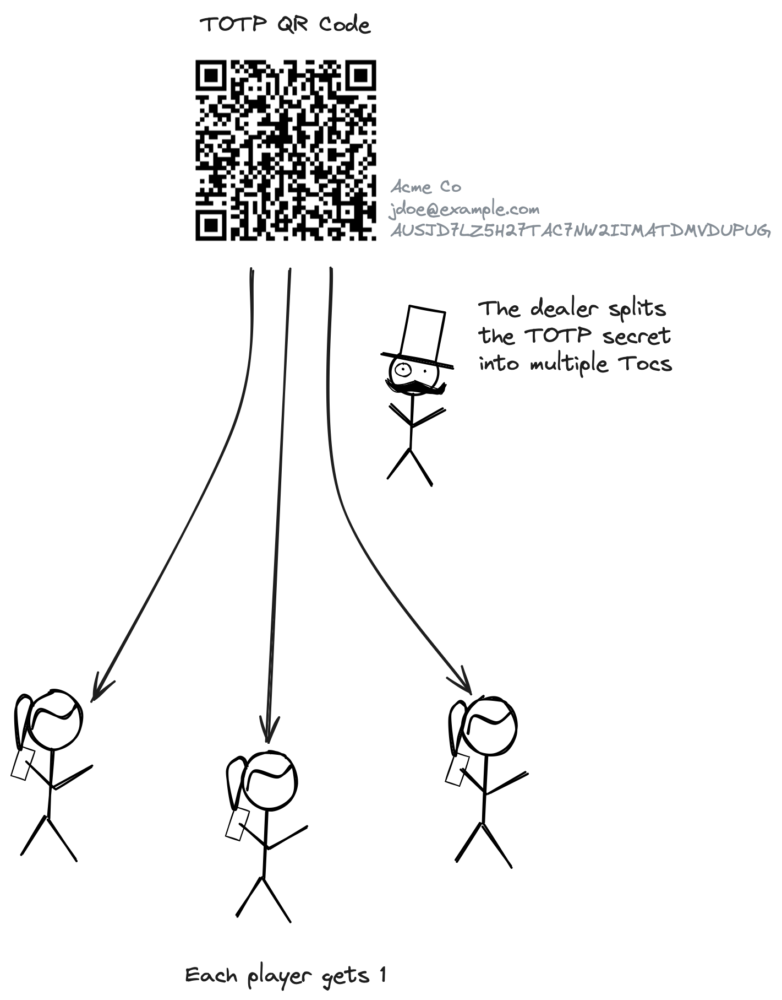
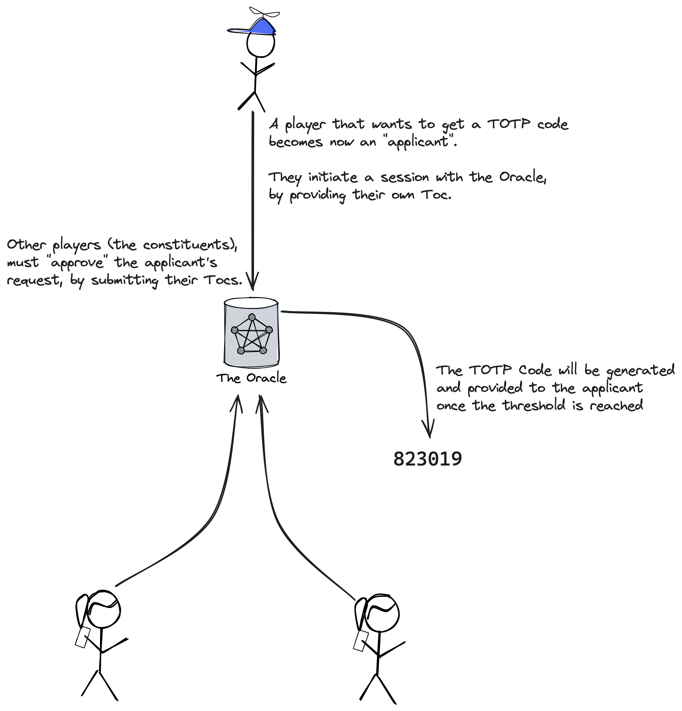

# farMFA

> Secure, distributed Multi-Factor Authentication system based on TOTP and Shamir's Secret Sharing.

  
  


## Concept

Multi-Factor Authentication (MFA) is often implemented using the TOTP standard ([RFC6238](https://www.rfc-editor.org/info/rfc6238)) from OATH.

1. The authentication server generates a secret key, stores it, and shows it to the user as a QR code or a Base32 string. The user stores it in a mobile app or password manager.
2. Upon login, the user inputs a One-Time Password (OTP). The authenticator app or password manager generates this password by applying the TOTP algorithm to the secret key and the current time.
3. The authentication server performs the same algorithm on the secret key and current time. If the output matches the user’s TOTP, the authentication is successful.

The generated One-Time Password may only be used once, or within a certain timeframe, depending on the server implementation.

farMFA is designed for shared environments where access to certain accounts should be restricted to very special occasions, such as accessing the root user of an AWS account. The goal is to restrict access so that multiple individuals are needed to grant authorization.

First, we apply the *Shamir’s Secret Sharing* scheme ([Shamir 1979](https://doi.org/10.1145/359168.359176)) to the original TOTP secret key. For instance, at least 3 out of 5 holders must combine their shares to reconstruct the secret.

Additionally, farMFA implements a workflow to reassemble the TOTP secret on a server, allowing users to access only the generated TOTP code without risking accidental leaks of the secret.


## Getting Started

The two main workflows are:

1. Getting the TOTP secret, splitting it, and sharing it with multiple parties (players). This is done locally.
2. Combining the shares (Tocs) and generating the TOTP. This is done by the server/oracle.

### Split TOTP Secret and Share



During this phase, farMFA encrypts the Tocs based on the intended recipient (player). The current encryption strategy uses [age](https://filippo.io/age).

Each player generates their age keypair via [age-keygen](https://github.com/FiloSottile/age#readme):

```shell
age-keygen -o player_1.txt

# And if you're now testing by yourself, generate a few more keys
age-keygen -o player_2.txt
age-keygen -o player_3.txt
```

Players then share their public key with the dealer.

The dealer starts the process, usually providing their own age public key and keeping one Toc for themselves:


```shell
farmfa dealer \
  --totp-secret HXDMVJECJJWSRB3HWIZR4IFUGFTMXBOZ \
  -p player_1=age17tpq2z00asnnc0w6mpn59ygej9chfqhhexfw5rdl4j838pzkfv8s8yg97c \
  -p player_2=age1h7lxfhnm54knla7jnc4wf3h5lkpew9ef6mcy66qckxywwtt4uq9s5rd99m \
  -p player_3=age1rq6hyc8tsht8rsdjfzaedzmhwcxjeps6ve9nrdljk3t34h0gxpastw62qp
```

This generates encrypted Tocs, one per player. Each player then decrypts and inspects their Toc using the age CLI:

```shell
age -i player_1.txt --decrypt
[paste the encrypted Toc - Ctrl+D]

{
    "group_id": "7GCUCI2Y",
    "group_size": 3,
    "group_threshold": 3,
    "note":"",
    "share":"C2iCgb3pRfxPJw2a7od8p4ShkhrDWAm/Dt6ioQNAVFPZ",
    "toc_id":"5oaAUX9b6aBE"
}
```

Players must store their Toc securely.

### Generate a TOTP



When a user wants to log in, they start a session. The user initiating the login is called the applicant.

```shell
# For testing purposes, we'll now start the server locally - in production, this should be a remote server
farmfa server &

http --body POST localhost:8080/sessions toc_zero:='{"group_id":"J7UHQPZK","group_size":5,"group_threshold":2,"share":"5Ovpu-PKEeYXx5ebiQhzU_AT0Z79POf8GGkskDp3its=urkBkVXr-pYjIvTt1ch2YJILCScAoRquLoX_VBxxps4=","toc_id":"TFW52GAK"}'
{
    "complete": false,
    "created_at": "2021-02-24T18:05:53.507396809+01:00",
    "id": "V5K6QD4XUFLRGCZH",
    "kek": "MIotBtYOWrXnQCj6o9rSNIkNeRfIPhNLjEdQtJDDemPRJcKUbme+iq5K2Hc6Ypil6Loi/K9rnN/YrJiKDT/tPi8kFq2WuAY8zl8=",
    "tek": "age1cl5ndmdsq09vs09awlpt8nd4cdu6fpl33lpyyuv75syknqalkpdszwnwyc",
    "toc_group_id": "J7UHQPZK",
    "tocs_in_group": 5,
    "tocs_provided": 1,
    "tocs_threshold": 2
}
```

The oracle returns:

* A session ID.
* A Toc Encryption Key (TEK) - a public key to encrypt individual Tocs.
* A Key Encryption Key (KEK) - to decrypt the private part of the TEK.

The applicant shares the TEK and session ID with team members holding the other Tocs. These team members, who can authorize the applicant, are called constituents.

Constituents encrypt and armor their Toc with TEK using age:

```shell
export ENCTOC=$(echo '{"group_id":"J7UHQPZK","group_size":5,"group_threshold":2,"share":"zxRrozuUaCMgn_u6ajZStlV7RKwhp0keT9aQoXAEruI=nfx2CPJfKiFM32zLmtxHjV94OlZOgBevV1Whrx-lslU=","toc_id":"K5FSSJSV"}' | age -r age1cl5ndmdsq09vs09awlpt8nd4cdu6fpl33lpyyuv75syknqalkpdszwnwyc -a)
```

Constituents upload the encrypted Toc to the oracle, associating it with the existing session:

```shell
http POST localhost:8080/sessions/V5K6QD4XUFLRGCZH/tocs encrypted_toc="$ENCTOC"
HTTP/1.1 200 OK
```

Once the oracle has enough Tocs, the applicant may query the oracle. The applicant provides the KEK to let the oracle decrypt the Tocs and generate the TOTP:

```shell
http --body POST localhost:8080/sessions/V5K6QD4XUFLRGCZH/totp kek="MIotBtYOWrXnQCj6o9rSNIkNeRfIPhNLjEdQtJDDemPRJcKUbme+iq5K2Hc6Ypil6Loi/K9rnN/YrJiKDT/tPi8kFq2WuAY8zl8="
{
    "totp": "824588"
}
```

## References
- [RFC6238](https://www.rfc-editor.org/info/rfc6238): M’Raihi, D., Machani, S., Pei, M., and J. Rydell, "TOTP: Time-Based One-Time Password Algorithm", RFC 6238, DOI 10.17487/RFC6238, May 2011.
- [Shamir's Secret Sharing](https://doi.org/10.1145/359168.359176): Adi Shamir. 1979. "How to share a secret". Commun. ACM 22, 11 (Nov. 1979), 612–613.

## Glossary
- **Secret:** A TOTP is a hash generated from a secret. This secret is usually shown as a QR code and shared between the prover and verifier. In farMFA, the prover is distributed among recipients who share the key material and an oracle that generates the TOTP.
- **Toc:** The "pieces" in which a TOTP secret gets split.
- **Deal:** The workflow in which a dealer splits a secret into Tocs and shares them with multiple players.
- **Dealer:** Creates Tocs from a secret and shares them with players.
- **Player:** Individuals who receive one of the Tocs during the Tocs creation phase.
- **Session:** The workflow in which an applicant requires combining Tocs to generate a TOTP.
- **Applicant:** Initiates a session to request access to a TOTP.
- **Constituent:** Individuals who join a session to authorize an applicant to generate a TOTP by reaching a quorum/threshold.
- **Oracle:** The entity that reconstructs Tocs into TOTP secrets and generates one-time passwords. Also called the prover, as defined in [RFC6238](https://www.rfc-editor.org/info/rfc6238).
- **Server:** Synonym for oracle in this context.
- **TOTP:** As defined in [RFC6238](https://www.rfc-editor.org/info/rfc6238): "an extension of the One-Time Password (OTP) algorithm to support the time-based moving factor". Used by many applications as a second authentication factor.
